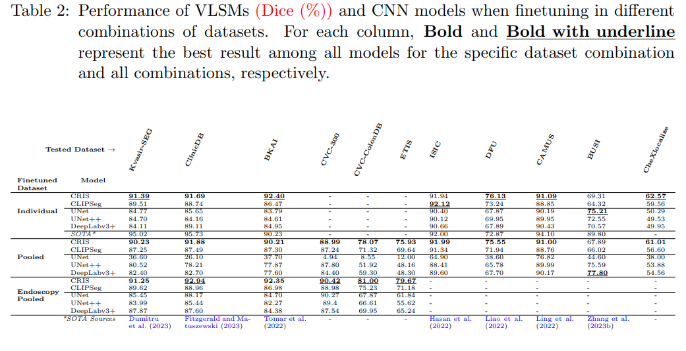

# Exploring Transfer Learning in Medical Image Segmentation using Vision-Language Models

*Accpeted at MIDL 2024*

ArXiv Link: [arxiv.org/abs/2308.07706](https://arxiv.org/abs/2308.07706)

## Abstract

Medical image segmentation allows quantifying target structure size and shape, aiding in disease diagnosis, prognosis, surgery planning, and comprehension. Building upon recent advancements in foundation Vision-Language Models (VLMs) from natural image-text pairs, several studies have proposed adapting them to Vision-Language Segmentation Models (VLSMs) that allow using language text as an additional input to segmentation models. Introducing auxiliary information via text with human-in-the-loop prompting during inference opens up unique opportunities, such as open vocabulary segmentation and potentially more robust segmentation models against out-of-distribution data. Although transfer learning from natural to medical images has been explored for image-only segmentation models, the joint representation of vision-language in segmentation problems remains underexplored. This study introduces the first systematic study on transferring VLSMs to 2D medical images, using carefully curated datasets encompassing diverse modalities and insightful language prompts and experiments. Our findings demonstrate that although VLSMs show competitive performance compared to image-only models for segmentation after finetuning in limited medical image datasets, not all VLSMs utilize the additional information from language prompts, with image features playing a dominant role. While VLSMs exhibit enhanced performance in handling pooled datasets with diverse modalities and show potential robustness to domain shifts compared to conventional segmentation models, our results suggest that novel approaches are required to enable VLSMs to leverage the various auxiliary information available through language prompts.

## Table of Contents
- [Methodology](#methodology)
- [Installation](#installation)
- [Usage](#usage)
  - [Pretrained Model Preparation](#pretrained-model-preparation) 
  - [Dataset Preparation](#dataset-preparation)
  - [Zero-Shot Segmentation](#zero-shot-segmentation)
  - [Finetuning](#finetuning)
- [Results](#results)

## Methodology

<div style="text-align: center;">
  
</div>

## Installation

To get started, it's recommended to create a Python (preferably `v3.10.12`) environment using either Conda or venv. This helps to manage dependencies and ensure a consistent runtime environment.

1. **Conda:**
```sh
  conda create --name your_env_name python=3.10
  conda activate your_env_name
```
**OR**

2. **venv:**
```sh
  python -m venv your_env_name
  source your_env_name/bin/activate
```

Once your environment is active, install the required packages from `requirements.txt` using pip:
```sh
  pip install -r requirements.txt
```

## Usage

### Pretrained Model Preparation
#### BiomedCLIP and CLIPSeg
Note: *You can skip the text below, it is for informative purpose only.*

Because the pretrained weights of [BiomedCLIP](https://huggingface.co/microsoft/BiomedCLIP-PubMedBERT_256-vit_base_patch16_224) and [CLIPSeg](https://huggingface.co/CIDAS/clipseg-rd64-refined) are readily available in the *Hugging Face Model Hub*, they are automatically downloaded by the python scripts during training or inference.

#### CRIS

The Resnet50 vision-encoder of CLIP is needed for CRIS can be downloaded from [here](https://openaipublic.azureedge.net/clip/models/afeb0e10f9e5a86da6080e35cf09123aca3b358a0c3e3b6c78a7b63bc04b6762/RN50.pt) using the following command.

```sh
  wget https://openaipublic.azureedge.net/clip/models/afeb0e10f9e5a86da6080e35cf09123aca3b358a0c3e3b6c78a7b63bc04b6762/RN50.pt -O pretrain/RN50.pt
```


We have not yet found the official link to download the CRIS model.
We have used the model from [CRIS's repo's issue](https://github.com/DerrickWang005/CRIS.pytorch/issues/3) using [this OneDrive link](https://polimi365-my.sharepoint.com/:f:/g/personal/10524166_polimi_it/Ej-lkQiFHU1ArDG68PP-u3kBJL_UBvvn1scRU7Ps5fiIOw?e=KzFowg).


The downloaded CRIS model needs to be loaded in `DataParallel` mode.
To convert the model, run the following command after saving the downloaded model to `pretrained/cris.pt`:

```sh
  python scripts/convert_cris_model.py
```

### Dataset Preparation
Please refer to [DATASETS.MD](DATASETS.MD) for more details.

### Zero-Shot Segmentation

To perform zero-shot segmentation, you can use the provided script. Open a terminal and navigate to the project directory, then execute the following command:
```sh
  python scripts/zss.py
```
This script will initiate the zero-shot segmentation process and produce the desired results.

### Finetuning

If you need to run our fine-tuning models, you can use the provided script:
```sh
  python scripts/finetune.py
```

This script will start the fine-tuning process, which is essential for customizing the model for specific tasks. 
In the file, all of the methods have been defined as bash scripts.
For running inference, please update the defaults configs (such as `ckpt_path`, `models`, etc.) in `scripts/inference.py` to get the evulation metric or generate the output masks (in the original resolution).

## Results

<div style="text-align: center;">
  
</div>

### Acknowledgement
We would like to thank [Lightning-Hydra-Template](https://github.com/ashleve/lightning-hydra-template) for providing a modifiable framework for running multiple experiments while tracking the hyperparameters.